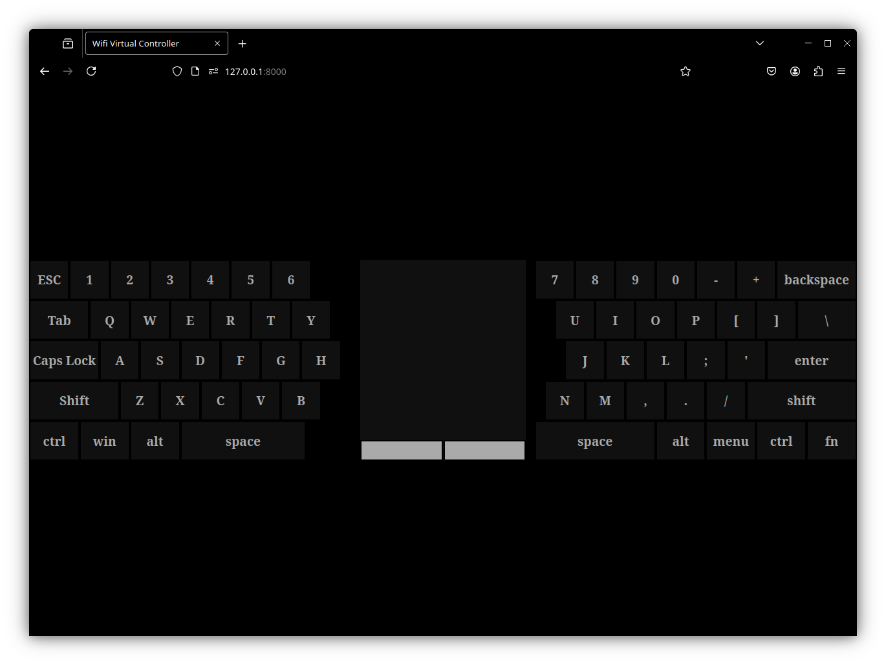

# Virtual Keyboard & Touchpad Controller

A web-based virtual keyboard and touchpad that lets you control your PC remotely using your phone. Built with Django (backend), WebSocket for real-time communication, and vanilla JavaScript (frontend). Works over the internet if hosted, for example, via SSH tunneling.

---

## ✨ Features

- **Virtual Keyboard:** Minimal keyboard layout with multi-key and touch support.
- **Touchpad:** Swipe and tap gestures to control the mouse cursor.
- **Remote Control:** Use your phone as a controller for your PC.
- **Real-Time:** WebSocket enables instant key and mouse events.
- **Cross-Platform:** Works on any device with a modern browser.
- **Host Anywhere:** Deploy on your own server or use over SSH.

---

## 🛠️ Tech Stack

- **Backend:** Django (Python)
- **Frontend:** Vanilla JavaScript
- **Communication:** WebSocket
- **Deployment:** Anywhere (local, cloud, SSH tunnel, etc.)

---

